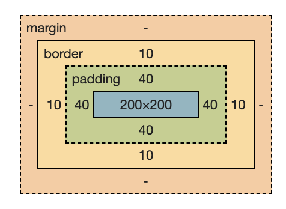

# `box-sizing`

요소의 크기 계산 기준을 지정

| 값              | 의미                                                           | 기본값      |
| --------------- | -------------------------------------------------------------- | ----------- |
| content-box     | width, height 만으로 요소의 크기를 계산                        | content-box |
| ~~padding-box~~ | 브라우저 호환성이 좋지 못해서, 사용을 권장하지 않음            |             |
| border-box      | width, height에 padding과 border를 포함하여 요소의 크기를 계산 |             |

- `content-box`: 실제 content가 표시되는 부분 (파란색 부분)

- `padding-box`: `content-box + padding`

- `border-box`: `content-box + padding + border`
